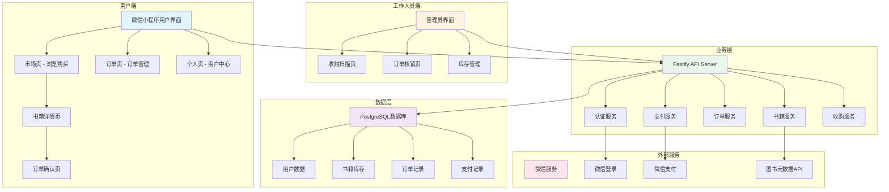
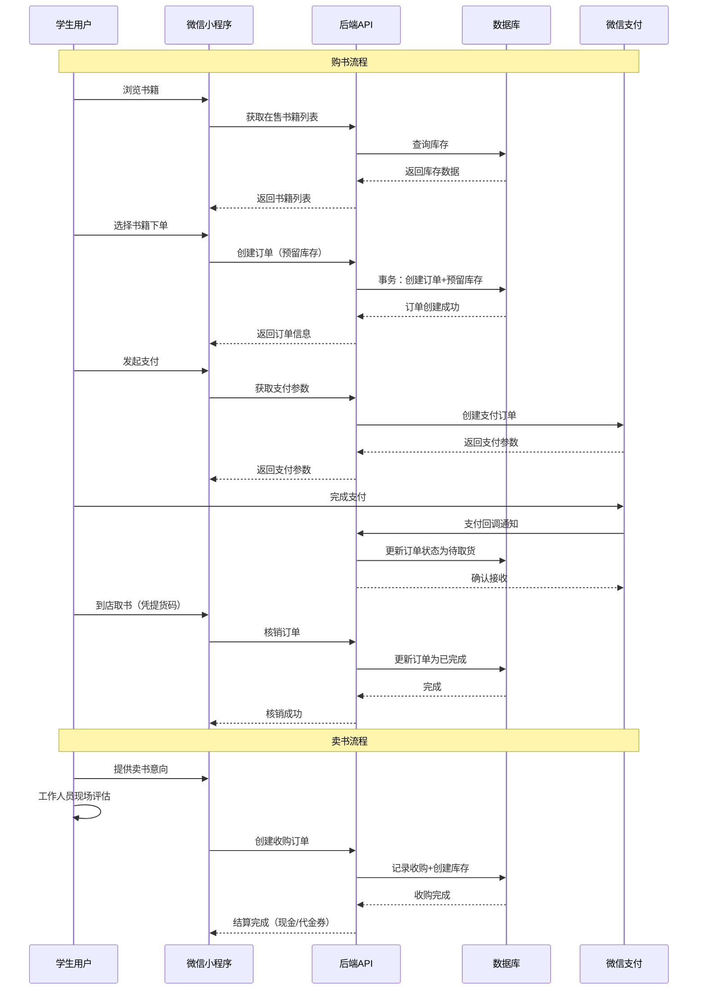
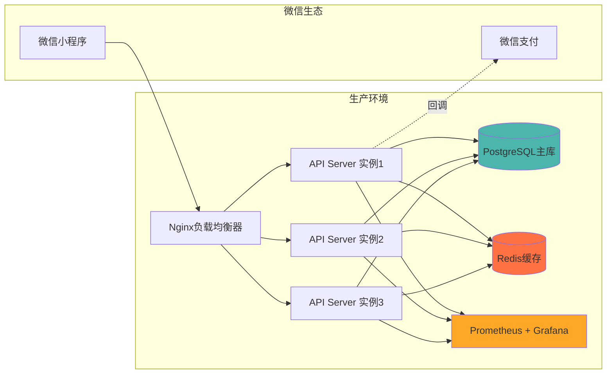
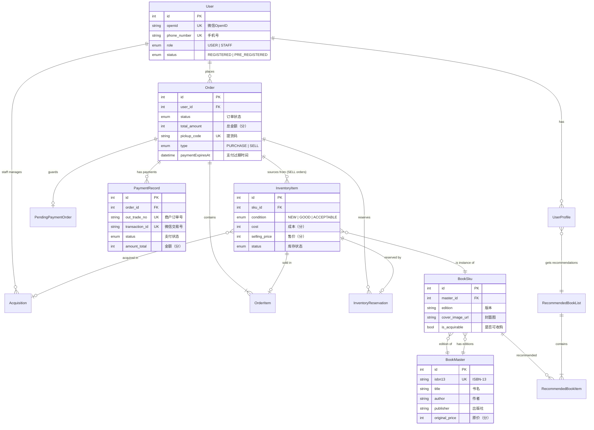
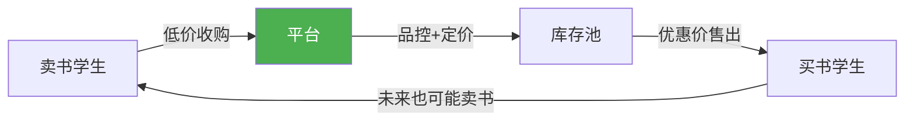

# 校园书市 (Bookworm) - 创业项目申报资料

> **版本**: v1.0.1
> **项目类型**: 校园二手教材交易平台（微信小程序）
> **编制日期**: 2025年

---

## 📋 目录

1. [项目概述](#项目概述)
2. [信息架构图](#信息架构图)
3. [技术架构](#技术架构)
4. [数据模型](#数据模型)
5. [商业计划书（BP）](#商业计划书)

---

## 项目概述

### 核心定位

**校园书市** 是一个专注于校园二手教材交易的微信小程序平台，采用"平台自营 + C2B2C"的混合运营模式，解决大学生教材购买成本高、二手教材流通难的痛点。

### 核心价值主张

- 📚 **学生买书更便宜**：二手教材价格比新书便宜30-70%
- 💰 **学生卖书有收益**：毕业生闲置教材变现，支持现金或代金券结算
- ✅ **品控有保障**：平台统一收购、审核、定价，确保书籍质量
- 🚀 **交易更便捷**：线上下单、校内自提，无需快递

### 项目进展

- ✅ **产品开发**：已完成1.0版本，包含完整的购买、收购、订单、支付功能
- ✅ **技术栈**：微信小程序 + Node.js + PostgreSQL，具备高可用性和扩展性
- ✅ **测试验证**：通过完整的单元测试和集成测试，代码覆盖率达标
- 🔄 **运营准备**：准备在目标校园进行试点运营

---

## 信息架构图

### 系统整体架构



### 用户业务流程



---

## 技术架构

### 1. 前端架构（微信小程序）

```
miniprogram/
├── pages/               # 页面
│   ├── market/         # 市场首页（TabBar）- 浏览和搜索书籍
│   ├── orders/         # 订单列表（TabBar）- 查看用户订单历史
│   ├── profile/        # 个人中心（TabBar）- 用户信息和设置
│   ├── book-detail/    # 书籍详情 - 查看单本书详情和购买
│   ├── order-confirm/  # 订单确认 - 确认订单信息和发起支付
│   ├── order-detail/   # 订单详情 - 查看订单状态和提货码
│   ├── acquisition-scan/ # 收购扫描（工作人员）- 扫ISBN收书
│   └── customer-service/ # 客服页面 - 联系客服
├── utils/              # 工具模块
│   ├── api.js         # API请求封装
│   ├── auth.js        # 微信登录和授权
│   ├── token.js       # Token管理
│   ├── payment.js     # 支付流程封装
│   └── ui.js          # UI工具函数
└── app.wxss           # 全局样式（V10设计系统）
```

**技术特点**：
- 模块化架构，职责清晰
- 全局状态管理（token、用户信息）
- 统一API封装，自动处理401认证失效
- 支付流程健壮，包含错误重试和用户引导

### 2. 后端架构（Node.js + Fastify）

```
bookworm-backend/
├── src/
│   ├── routes/          # API路由层
│   │   ├── auth.ts      # 认证接口（微信登录、手机号授权）
│   │   ├── books.ts     # 书籍接口（搜索、推荐、元数据）
│   │   ├── inventory.ts # 库存接口（查询、添加）
│   │   ├── orders.ts    # 订单接口（创建、查询、核销）
│   │   ├── payment.ts   # 支付接口（发起支付、回调）
│   │   └── acquisitions.ts # 收购接口（检查、创建）
│   ├── services/        # 业务逻辑层
│   │   ├── authService.ts      # 微信OAuth、账号合并
│   │   ├── orderService.ts     # 订单处理（含库存预留）
│   │   ├── inventoryService.ts # 库存管理
│   │   ├── bookService.ts      # 书籍搜索和管理
│   │   └── refundService.ts    # 退款处理
│   ├── adapters/        # 外部服务适配器
│   │   └── wechatPayAdapter.ts # 微信支付SDK封装
│   ├── plugins/         # Fastify插件
│   │   ├── auth.ts      # JWT认证插件
│   │   ├── metrics.ts   # Prometheus监控插件
│   │   └── rateLimit.ts # 限流插件
│   ├── jobs/            # 定时任务
│   │   ├── cancelExpiredOrders.ts # 取消过期订单
│   │   ├── refundProcessor.ts     # 处理退款
│   │   └── inventoryMetrics.ts    # 库存指标统计
│   └── db/              # 数据库层
│       ├── transaction.ts # 事务工具
│       └── views/         # 数据视图（安全选择器）
└── prisma/
    └── schema.prisma    # 数据库Schema定义
```

**架构亮点**：

1. **分层架构**：Routes → Services → Database，职责清晰
2. **事务安全**：所有涉及多表操作的业务都包裹在数据库事务中
3. **依赖注入**：Services接受 `dbCtx` 参数，便于测试和事务管理
4. **类型安全**：TypeScript + TypeBox进行请求参数校验
5. **监控完善**：Prometheus指标 + 结构化日志（Pino）
6. **高可用**：连接池管理、优雅关闭、健康检查端点

### 3. 基础设施架构



**部署特性**：
- Docker容器化部署
- 多实例负载均衡（支持水平扩展）
- PostgreSQL连接池管理（防止连接泄漏）
- 环境变量配置（64个配置项，包含验证）
- 健康检查和自动重启

---

## 数据模型

### 核心实体关系图（ER图）



### 数据模型详解

#### 1. 用户体系（User + UserProfile）

**User表** - 核心用户信息
- **认证方式**：微信OpenID（主要） + 手机号（可选，用于账号合并）
- **用户状态**：
  - `REGISTERED`: 已通过微信登录的正式用户
  - `PRE_REGISTERED`: 通过卖书流程创建的占位账号（仅有手机号）
- **角色权限**：
  - `USER`: 普通学生用户
  - `STAFF`: 工作人员（可以收购书籍、核销订单）

**UserProfile表** - 学生身份信息
- 入学年份（enrollment_year）
- 专业（major）
- 班级（class_name）
- 用于个性化推荐教材

**账号合并机制**：
当PRE_REGISTERED用户首次通过微信登录并授权手机号时，系统自动合并账号，保留历史卖书记录。

#### 2. 书籍体系（BookMaster + BookSku + InventoryItem）

**三层架构设计**：

1. **BookMaster（书籍主数据）**
   - 一个ISBN对应一本书的元数据
   - 存储：标题、作者、出版社、原价
   - 数据来源：外部图书元数据API + 手动录入

2. **BookSku（书籍SKU）**
   - 一本书的不同版本（如"第3版"、"第4版"）
   - 每个SKU有独立的封面图
   - `is_acquirable`标记：该版本是否接受收购

3. **InventoryItem（库存单品）**
   - **原子库存模型**：每一本实体书对应一条记录
   - 字段：
     - `condition`: 书况（全新/良好/可接受）
     - `cost`: 收购成本
     - `selling_price`: 销售价格
     - `status`: 状态（在库/已预留/已售出/批量收购等）
     - `sourceOrderId`: 来源订单（对于SELL类型订单）
     - `acquisitionId`: 收购记录关联

**状态流转**：
```
in_stock（在库）
  → reserved（用户下单预留）
  → sold（支付完成，已售出）
  → completed（用户取货，交易完成）
```

#### 3. 订单体系（Order + OrderItem + InventoryReservation）

**Order表** - 订单主表
- **订单类型**（type字段）：
  - `PURCHASE`: 学生购书订单（主流程）
  - `SELL`: 学生卖书订单（收购流程）

- **订单状态流转**（PURCHASE订单）：
  ```
  PENDING_PAYMENT（待支付）
    → PENDING_PICKUP（待取货）
    → COMPLETED（已完成）
  ```
  或提前终止：
  ```
  PENDING_PAYMENT → CANCELLED（已取消，超时未支付）
  ```

- **核心字段**：
  - `pickup_code`: 唯一提货码（10位随机字符）
  - `paymentExpiresAt`: 支付超时时间（默认15分钟）
  - `pickupExpiresAt`: 取货超时时间（支付后7天）
  - `total_amount`: 订单总金额（单位：分）

**OrderItem表** - 订单明细
- 记录订单包含的每本书
- 冗余记录 `price`（成交价），防止后续价格变动影响历史记录

**InventoryReservation表** - 库存预留
- 订单创建时，将库存状态改为`reserved`
- 建立 `inventory_item_id` 和 `order_id` 的关联
- 订单取消时，通过此表释放库存

**PendingPaymentOrder表** - 待支付订单守卫
- **业务规则**：一个用户同时只能有一个待支付订单
- 通过唯一约束 `UNIQUE(user_id)` 在数据库层面强制执行
- 防止用户恶意占用库存

#### 4. 支付体系（PaymentRecord + WebhookEvent）

**PaymentRecord表** - 支付记录
- **状态流转**：
  ```
  PENDING（待支付）
    → SUCCESS（支付成功）
    → REFUND_REQUIRED（需退款，订单取消）
    → REFUND_PROCESSING（退款处理中）
    → REFUNDED（已退款）
  ```

- **关键字段**：
  - `out_trade_no`: 商户订单号（系统生成，唯一）
  - `transaction_id`: 微信支付交易号（支付成功后回填）
  - `payer_openid`: 付款人OpenID
  - `refund_id`: 退款单号（如有退款）
  - `refund_attempts`: 退款重试次数

**WebhookEvent表** - 支付回调幂等性保障
- 记录每个微信支付回调的唯一事件ID
- 防止重复处理（网络重试导致的重复通知）
- `processed`标记：该事件是否已处理

#### 5. 收购体系（Acquisition）

**Acquisition表** - 收购记录
- 记录每次收购交易
- 字段：
  - `staff_user_id`: 操作的工作人员
  - `customer_user_id`: 卖书学生（可能是PRE_REGISTERED用户）
  - `total_value`: 收购总价值
  - `item_count`: 收购书籍数量
  - `settlement_type`: 结算方式（现金/代金券）
  - `voucher_code`: 代金券编号（如选择代金券结算）
  - `notes`: 备注信息

- 关联：
  - 一条Acquisition可以关联多个InventoryItem（通过`acquisitionId`外键）

#### 6. 推荐体系（RecommendedBookList + RecommendedBookItem）

**RecommendedBookList表** - 专业推荐书单
- 按`(enrollment_year, major)`组织
- 例如："2021级-计算机科学与技术"的推荐教材清单

**RecommendedBookItem表** - 推荐书目明细
- 关联BookSku
- 支持为不同专业、不同年级配置不同的教材推荐

---

## 商业计划书

### 一、项目介绍

#### 1.1 项目背景

**市场痛点**：
- 📖 **新书价格高**：大学教材平均单价80-150元，一学期购书支出500-1000元
- 🗑️ **旧书处置难**：毕业生平均积压教材30-50本，二手交易渠道分散、效率低
- 🤝 **信息不对称**：校园二手书市场依赖QQ群、贴吧等非正式渠道，缺乏信任机制
- ⏱️ **交易成本高**：线下摆摊、快递交易费时费力

**我们的解决方案**：
搭建校园二手教材交易平台，通过平台统一收购、品控、定价、配送，提供标准化的二手教材交易服务。

#### 1.2 产品功能

**学生端（微信小程序）**：
1. **浏览购书**
   - 按专业、年级智能推荐教材
   - 全文搜索（书名、作者、ISBN）
   - 筛选条件：书况、价格区间

2. **下单支付**
   - 在线下单（支持多本合并）
   - 微信支付（支持退款）
   - 实时订单状态追踪

3. **到店自提**
   - 生成唯一提货码
   - 校内自提点取书（无需快递）

4. **卖书变现**
   - 扫ISBN快速评估
   - 即时结算（现金或代金券）
   - 代金券有双倍价值激励

**工作人员端**：
1. **收购管理**
   - 扫码录入ISBN
   - 现场评估书况和定价
   - 批量收购处理

2. **订单核销**
   - 扫描/输入提货码
   - 验证订单状态
   - 完成交易

3. **库存管理**
   - 实时库存查询
   - 库存状态追踪（在库/预留/已售）

#### 1.3 核心优势

**1. 平台自营模式，质量可控**
- 平台统一收购、审核，确保书籍质量
- 标准化定价体系，避免漫天要价
- 专业团队运营，服务有保障

**2. 技术驱动，效率更高**
- 自动化库存管理（原子库存模型）
- 智能推荐算法（基于专业和年级）
- 支付流程优化（15分钟超时保护）

**3. 闭环激励，用户粘性强**
- 代金券模式：卖书所得可加倍用于购书
- 校内自提：无需快递，降低交易成本
- 口碑传播：解决刚需，自然增长

**4. 数据资产，可持续发展**
- 积累校园教材数据库（哪些书热门、哪些滞销）
- 了解学生购书习惯和偏好
- 为未来拓展（教辅、考研资料等）奠定基础

---

### 二、市场分析

#### 2.1 市场规模

**目标市场**：全国高校在校大学生

- **市场容量**：
  - 全国在校大学生：**约4000万人**（2024年数据）
  - 年均教材支出：**600-1200元/人**
  - 二手教材渗透率（保守估计）：**30%**
  - **潜在市场规模**：4000万 × 900元 × 30% ≈ **108亿元/年**

- **单校市场**（以2万人规模高校为例）：
  - 目标用户：2万人
  - 渗透率：20%（初期）
  - 年交易次数：人均2次/年
  - 客单价：150元
  - **年GMV**：20000 × 20% × 2 × 150 = **120万元**

#### 2.2 竞争分析

**现有竞争对手**：

| 类型 | 代表 | 优势 | 劣势 | 我们的差异化 |
|------|------|------|------|--------------|
| **线下摆摊** | 校园地摊、宿舍楼下 | 成本低、灵活 | 不规范、书况参差不齐、时间受限 | 线上化、标准化、全天候服务 |
| **社群交易** | QQ群、微信群、贴吧 | 无中间商 | 信息混乱、交易风险高、效率低 | 平台担保、品控、高效匹配 |
| **综合二手平台** | 闲鱼、转转 | 用户基数大 | 非垂直领域、校园属性弱、快递成本高 | 深耕校园、自提模式、专业推荐 |
| **图书租赁** | 借书平台 | 降低成本 | 需归还、使用受限 | 买断所有权、可标注笔记 |

**我们的护城河**：
1. **垂直深耕**：专注校园教材，理解学生需求
2. **自提网络**：每个校园建立自提点，快递平台无法复制
3. **数据积累**：掌握各专业教材清单和需求规律
4. **品牌信任**：长期运营建立的口碑和信任

#### 2.3 用户画像

**买书用户**：
- 年龄：18-22岁本科生
- 需求：降低教材开支（特别是大一新生）
- 痛点：新书贵、不知道买哪些书、怕买到盗版
- 使用场景：每学期开学前1-2周集中购买

**卖书用户**：
- 年龄：22-24岁毕业生
- 需求：处理闲置教材、回收部分成本
- 痛点：线下收购价格低、在线交易麻烦
- 使用场景：毕业前1-2个月集中清理

**使用行为特征**：
- 移动端为主（100%微信小程序）
- 搜索 + 推荐并重（60%搜索，40%推荐）
- 价格敏感度高（对比原价）
- 信任熟人推荐

---

### 三、商业模式

#### 3.1 运营模式：平台自营 + C2B2C



**核心流程**：

1. **收购环节（C2B）**：
   - 学生通过小程序或线下联系工作人员
   - 工作人员扫描ISBN，系统自动评估收购价
   - 现场验书况，确定最终价格
   - 即时结算（现金或代金券，代金券价值×2）

2. **销售环节（B2C）**：
   - 平台统一上架，标注书况和价格
   - 学生线上下单支付
   - 生成提货码，校内自提点取书

3. **增值服务**：
   - 代金券激励系统（鼓励复购）
   - 智能推荐（基于专业和年级）
   - 学期开始前预售（提前备货）

#### 3.2 定价策略

**收购定价**：
- 新书/次新书（9成新以上）：原价 × **30-35%**
- 良好书况（7-8成新）：原价 × **20-25%**
- 可接受书况（5-6成新）：原价 × **10-15%**
- 破损严重/盗版：不收购

**售出定价**：
- 新书/次新书：原价 × **60-65%**
- 良好书况：原价 × **50-55%**
- 可接受书况：原价 × **35-40%**

**毛利率**：
- 平均毛利率：**30-35%**
- 热门教材毛利率更高（40%+）
- 冷门书籍可能亏损（需价格调整或停止收购）

**示例**：
| 书况 | 原价 | 收购价 | 售价 | 毛利 | 毛利率 |
|------|------|--------|------|------|--------|
| 9成新 | 100元 | 32元 | 62元 | 30元 | 48% |
| 7成新 | 100元 | 22元 | 52元 | 30元 | 58% |
| 5成新 | 100元 | 12元 | 37元 | 25元 | 68% |

#### 3.3 收入模式

**主营收入**：
1. **买卖差价**（核心）：
   - 二手书交易毛利
   - 预计占总收入：**90%**

2. **代金券回收差**：
   - 学生选择代金券结算时，平台给予2倍价值代金券
   - 但并非所有代金券都会使用（沉默率约20-30%）
   - 已使用的代金券仍有毛利空间
   - 预计占总收入：**5%**

3. **增值服务**（未来规划）：
   - 考研资料、教辅销售
   - 图书寄卖服务（帮学生代卖稀缺书籍，收取佣金）
   - B端合作（与出版社、书店合作推广新书）
   - 预计占总收入：**5%**

#### 3.4 成本结构

**单校运营成本**（月度）：

| 成本项 | 金额 | 说明 |
|--------|------|------|
| **场地租金** | 2000元 | 小型仓库/自提点（20-30㎡） |
| **人力成本** | 8000元 | 2名兼职学生（4000元/人/月） |
| **库存成本** | 变动 | 收购支出（周转资金） |
| **运营推广** | 2000元 | 地推物料、线上推广 |
| **技术维护** | 500元 | 服务器、域名、第三方服务 |
| **其他杂费** | 500元 | 水电、耗材等 |
| **合计** | ~13000元/月 | 不含库存周转资金 |

**盈亏平衡点**（单校）：
- 假设毛利率：35%
- 月度固定成本：13000元
- 需要月GMV：13000 ÷ 35% ≈ **37000元**
- 日均GMV：1230元
- 日均订单（按客单价150元）：**8-10单**

**结论**：单校运营3-6个月后可达盈亏平衡。

---

### 四、运营计划

#### 4.1 启动阶段（第1-3个月）：种子用户冷启动

**目标**：
- 积累第一批种子用户（300-500人）
- 建立初始库存（500-800本）
- 验证产品功能和用户体验

**策略**：
1. **地推获客**：
   - 在宿舍楼、食堂、图书馆发放宣传单
   - 扫码注册送代金券（5元）
   - 首单优惠（满50减10）

2. **社群运营**：
   - 建立QQ群、微信群
   - 发布新书上架通知
   - 收集用户反馈

3. **重点收购**：
   - 主动联系毕业生（通过学长学姐渠道）
   - 提高收购价（亏本也要建立库存）
   - 集中收购热门专业教材

**预期成果**：
- 注册用户：500人
- 月GMV：2-3万元
- 库存：800本
- 用户反馈：收集50+条改进建议

#### 4.2 增长阶段（第4-9个月）：规模化运营

**目标**：
- 用户增长到2000-3000人
- 月GMV达到10-15万元
- 实现单校盈利

**策略**：
1. **口碑传播**：
   - 老用户推荐新用户奖励（双方各得5元代金券）
   - 学生会、社团合作推广
   - KOL合作（校园公众号、抖音）

2. **运营优化**：
   - 完善推荐算法（基于历史数据）
   - 优化库存周转（热门书快进快出，冷门书降价促销）
   - 改进用户体验（根据反馈迭代产品）

3. **学期营销**：
   - 开学季：大力推广，首单优惠
   - 期末季：加大收购力度，准备下学期库存
   - 毕业季：毕业生专场收购活动

**预期成果**：
- 注册用户：3000人
- 月GMV：12万元
- 单校月净利：15000-20000元

#### 4.3 扩张阶段（第10-18个月）：多校复制

**目标**：
- 复制模式到3-5个高校
- 总GMV达到50-80万元/月
- 探索区域化运营和集中采购

**策略**：
1. **标准化复制**：
   - 编写《校园运营手册》
   - 培训新校区负责人
   - 统一品牌和视觉

2. **供应链优化**：
   - 跨校调货（A校滞销的书可能在B校热销）
   - 集中采购（与出版社、书商谈判）
   - 建立区域仓储中心

3. **区域品牌**：
   - 打造"大学城最大二手书平台"品牌
   - 联合营销（多校联动活动）
   - 媒体曝光（校园媒体、本地媒体）

**预期成果**：
- 覆盖校区：5个
- 总注册用户：15000人
- 月GMV：70万元
- 月净利：12-15万元

---

### 五、团队介绍

#### 5.1 核心团队

**创始人/CEO** - [姓名]
- 背景：[学校] [专业] [年级]
- 职责：整体战略、融资、商务合作
- 优势：[例如：有电商实习经验、擅长市场营销等]

**技术负责人/CTO** - [姓名]
- 背景：计算机/软件工程专业
- 职责：产品开发、技术架构、系统维护
- 成果：已完成1.0版本开发（小程序+后端API+数据库）

**运营负责人/COO** - [姓名]
- 背景：[相关专业]
- 职责：用户运营、地推执行、客服管理
- 优势：[例如：学生会经验、社群运营经验等]

**财务/行政** - [姓名]（可兼职）
- 职责：财务管理、成本控制、行政事务

#### 5.2 顾问团队（如有）

- **创业导师**：[学校创业中心老师/校外创业导师]
- **技术顾问**：[计算机学院教授/企业技术专家]
- **商业顾问**：[电商从业者/投资人]

#### 5.3 团队优势

1. **学生创业，了解用户**：
   - 团队成员都是在校生，深刻理解用户需求
   - 易于获取种子用户信任

2. **技术自研，成本可控**：
   - 自主开发系统，无需外包
   - 快速迭代，灵活调整

3. **校园资源丰富**：
   - 有学校创业政策支持
   - 易于接触学生会、社团等渠道

4. **执行力强**：
   - [列举团队以往成果，如组织过大型活动、获得过奖项等]

---

### 六、财务预测

#### 6.1 启动资金需求

**种子轮融资需求：8-12万元**

| 用途 | 金额 | 说明 |
|------|------|------|
| **库存采购** | 5万元 | 初期收购500-800本教材（周转资金） |
| **场地装修** | 1万元 | 自提点装修、货架、标识 |
| **设备采购** | 0.5万元 | 电脑、扫码枪、打印机等 |
| **技术开发** | 1万元 | 服务器、域名、第三方服务年费 |
| **市场推广** | 1万元 | 地推物料、首批用户补贴 |
| **运营费用** | 1.5万元 | 前3个月人员工资、房租等 |
| **应急储备** | 1万元 | 不可预见支出 |

**资金来源**：
- 创业比赛奖金
- 学校创业基金
- 天使投资人
- 团队自筹

#### 6.2 收入预测（单校，18个月）

| 阶段 | 月份 | 月GMV | 毛利率 | 月毛利 | 月成本 | 月净利 |
|------|------|-------|--------|--------|--------|--------|
| **冷启动** | 1-3 | 2万 | 25% | 5000元 | 13000元 | -8000元 |
| **增长期** | 4-6 | 6万 | 30% | 18000元 | 13000元 | +5000元 |
| **增长期** | 7-9 | 10万 | 33% | 33000元 | 13000元 | +20000元 |
| **成熟期** | 10-12 | 13万 | 35% | 45500元 | 13000元 | +32500元 |
| **成熟期** | 13-15 | 15万 | 35% | 52500元 | 13000元 | +39500元 |
| **成熟期** | 16-18 | 15万 | 35% | 52500元 | 13000元 | +39500元 |

**关键假设**：
1. 学生用户渗透率达到15-20%（2万人学校，3000-4000用户）
2. 人均年交易2次，客单价150元
3. 毛利率随运营优化逐步提升（25% → 35%）
4. 成本相对固定（规模效应体现在毛利率提升）

**18个月累计财务**：
- 累计GMV：**144万元**
- 累计毛利：**47.1万元**
- 累计成本：**23.4万元**
- **累计净利**：**23.7万元**
- **投资回报周期**：约6个月达到盈亏平衡

#### 6.3 多校扩张财务模型（第2年）

**假设扩展到5个校区**：

| 指标 | 单校/月 | 5校/月 | 年度总计 |
|------|---------|--------|----------|
| GMV | 15万元 | 75万元 | **900万元** |
| 毛利（35%） | 5.25万元 | 26.25万元 | **315万元** |
| 成本 | 1.3万元 | 6.5万元 | **78万元** |
| 净利 | 3.95万元 | 19.75万元 | **237万元** |

**规模化后的成本优化**：
- 集中采购降低收购成本（5%）
- 跨校调货减少滞销损失（3%）
- 品牌效应降低获客成本（2%）
- **预计毛利率可提升至40%**，净利率提升至25-30%

#### 6.4 退出机制（3-5年）

**可能的退出路径**：

1. **被战略收购**：
   - 潜在买家：京东、当当、孔夫子旧书网等图书电商
   - 估值依据：用户数×单价 或 年GMV×倍数（1-2倍）
   - 预期估值：500-1000万元（覆盖20-30个校区）

2. **A轮融资**：
   - 时机：覆盖15-20个校区，年GMV达到3000万+
   - 融资额：300-500万元
   - 用途：快速扩张到50-100个校区，探索线上化（非自提模式）

3. **持续运营**：
   - 作为校园服务品牌长期运营
   - 年净利200-500万元（稳定期）
   - 团队分红，自负盈亏

---

### 七、风险分析与应对

#### 7.1 市场风险

**风险1：用户增长不及预期**
- **应对**：
  - 加大地推力度，提高首单补贴
  - 与学生会、社团合作推广
  - 优化推荐算法，提高复购率

**风险2：竞品进入市场**
- **应对**：
  - 快速建立本地化网络（自提点）
  - 积累数据资产（教材清单、用户偏好）
  - 打造品牌口碑，提高用户粘性

#### 7.2 运营风险

**风险3：库存积压**
- **应对**：
  - 数据分析预测热门书籍，精准采购
  - 滞销书降价促销或跨校调货
  - 建立退货机制（向收购源头退书，承担部分损失）

**风险4：资金链断裂**
- **应对**：
  - 严格控制库存周转周期（≤60天）
  - 代金券结算延长现金压力
  - 储备应急资金（至少3个月运营成本）

#### 7.3 政策风险

**风险5：学校政策变化**
- **应对**：
  - 与学校创业中心保持良好沟通
  - 合规经营（营业执照、税务登记）
  - 准备备选自提点方案（校外商铺）

**风险6：出版社版权问题**
- **应对**：
  - 二手书交易合法（首次销售权用尽原则）
  - 不销售盗版书籍
  - 必要时咨询法律顾问

#### 7.4 技术风险

**风险7：系统故障或安全问题**
- **应对**：
  - 完善测试覆盖率（已达标）
  - 定期备份数据库
  - 监控系统健康状态（Prometheus + Grafana）
  - 购买云服务SLA保障

---

## 附录

### A. 技术栈清单

**前端**：
- 微信小程序（原生）
- JavaScript ES6+

**后端**：
- Node.js 20
- Fastify Web框架
- TypeScript
- Prisma ORM
- PostgreSQL数据库

**DevOps**：
- Docker容器化
- Nginx负载均衡
- Prometheus + Grafana监控
- Testcontainers集成测试

**外部服务**：
- 微信登录 & 微信支付
- 图书元数据API（Tanshu API）

### B. 关键指标（KPI）

**用户指标**：
- DAU（日活用户）
- MAU（月活用户）
- 新用户注册数
- 用户留存率（次日/7日/30日）

**交易指标**：
- GMV（成交总额）
- 订单量（按类型：PURCHASE/SELL）
- 客单价
- 复购率

**运营指标**：
- 库存周转天数
- 滞销率（超过90天未售出）
- 代金券使用率
- 毛利率 / 净利率

**效率指标**：
- 获客成本（CAC）
- 用户生命周期价值（LTV）
- LTV/CAC比值（健康值：≥3）

### C. 里程碑计划

| 时间 | 里程碑 | 关键成果 |
|------|--------|----------|
| **M1** | 产品上线 | 小程序发布，注册用户100+ |
| **M3** | 达到盈亏平衡 | 月GMV达到3.7万元 |
| **M6** | 单校盈利 | 月净利1万+ |
| **M9** | 扩展到第2个校区 | 验证复制模式 |
| **M12** | 覆盖5个校区 | 总GMV达到50万/月 |
| **M18** | A轮融资 | 融资300-500万，扩展到20+校区 |

---

## 联系方式

**项目名称**：校园书市 (Bookworm)
**团队名称**：[填写团队名称]
**联系人**：[姓名]
**手机**：[手机号]
**邮箱**：[邮箱]
**学校**：[学校名称]

---

**文档版本**：v1.0
**最后更新**：2025年1月
**备注**：本文档为创业项目申报材料，数据基于实际开发的微信小程序系统。
